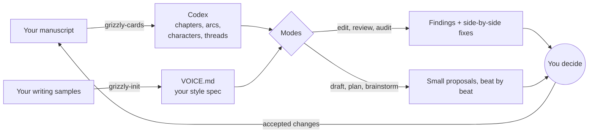

<p align="center">
  
</p>

<p align="center">
  <a href="LICENSE"></a>
  
  
  <a href="CONTRIBUTING.md"></a>
</p>

# Grizzly

**An open editor-in-a-skill for fiction writers** — novelists, webnovel serial
authors, anyone with a manuscript. Editors are expensive. AI is cheap but writes
slop. Grizzly's bet: the value of AI for fiction is not generation, it is
**diagnosis, structure, and memory**. The author keeps the pen.

## Why another AI writing tool

Every AI writing product fails writers the same way: it produces prose, the prose
has a voice, and the voice is the model's, not the author's. Grizzly inverts the
design:

- **It never writes your book for you.** Output is small, reviewable proposals: a
  few lines, side-by-side fixes, named findings. Never an unsolicited rewrite.
- **It diagnoses instead of generating.** Findings with locations, severity tiers,
  and honest verdicts. No praise padding.
- **It remembers everything.** An extractive card codex (chapters, arcs,
  characters, threads) so a 200-chapter serial costs the same to work on as a
  novella, and continuity errors get caught against recorded facts.
- **It learns your voice, not the model's.** Setup derives a voice spec from your
  own passages; every suggestion anchors against it.

## What it looks like in use

A surgical edit proposal (you accept, reject, or tweak each line):

> **Line 41 — emotion label.**
> ```diff
> - Mara felt the fear rise as the bell kept ringing.
> + The bell kept ringing. Mara counted the strokes.
> ```

A review finding:

> **[major] Ch 7, the cellar scene — buried landing.** The chapter exists to
> deliver the brother's betrayal, and it arrives in the flattest sentence of the
> scene, mid-paragraph. The beat needs to land through a concrete moment, not a
> summary. Routing: structure (grizzly-plan) or line work (grizzly-edit).

A cold-read audit verdict:

> I'd keep reading. The cellar scene pulls, but I skimmed the market chapter
> (no question raised for forty lines), and I cannot physically picture the
> innkeeper — she is a voice in white space. Highest-leverage change: give the
> market chapter one live thread.

## How it works



Three separated quality layers run under everything, because they fail
differently:

1. **Hygiene** (the blacklist): catches AI tells — em dashes, "not X but Y",
   emotion labels, cinematic filler.
2. **Delivery** (the six checks): catches the opposite failure, the spotless flat
   draft. Every scene needs the one place it lands.
3. **Architecture** (the technique deck): 21 researched structural moves — false
   peace, perspective fracture, hook rotation, escalation — with mechanisms and
   failure modes.

## What's inside

| Piece | What it does |
|---|---|
| `skills/grizzly` | Core: orientation, mode routing, the non-negotiable rails |
| `skills/grizzly-init` | Setup wizard: interview + voice-spec derivation |
| `skills/grizzly-cards` | The codex maker; bootstraps existing manuscripts |
| `skills/grizzly-edit` | Surgical line editing, diagnosis-first |
| `skills/grizzly-draft` | Beat-by-beat drafting on strict rails |
| `skills/grizzly-review` | Five-pass review: continuity, pacing, voice drift, hygiene, delivery |
| `skills/grizzly-audit` | Cold-read simulation: dread map, visualization check, belief check |
| `skills/grizzly-plan` | Arc and chapter structure, technique-deck integration |
| `skills/grizzly-brainstorm` | Costed directions anchored in your canon |
| `skills/grizzly-voice` | Voice spec derivation, updates, drift reports |
| `decks/` | Blacklist, delivery pass, dread toolkit, technique deck |
| `packs/` | Genre packs: progression fantasy, webnovel serial, romance |
| `docs/SPEC.md` | The tool-agnostic format spec |
| `docs/example-codex/` | A working codex built from *Treasure Island* |

## Install

**Option A — as a Claude Code plugin (recommended):**

```
/plugin marketplace add HarishDvs/Grizzly
/plugin install grizzly@grizzly
```

This installs the skills and ships the decks, templates, and packs alongside them.

**Option B — manual:**

1. Grab the latest archive from the
   [Releases page](https://github.com/HarishDvs/Grizzly/releases) (or clone the
   repo) and put it next to your manuscript.
2. Copy the folders under `skills/` into your project's `.claude/skills/` (or
   your user-level skills directory).

**Then, either way:**

3. Say **"set up grizzly for my novel"**. The init wizard interviews you, derives
   your voice spec from your own writing samples, and scaffolds the codex.
4. Have chapters already? Ask for a **codex bootstrap**; it cards your manuscript
   chapter by chapter.

The data layer (state files, codex, decks, packs) is plain markdown with zero
harness-specific syntax; see [docs/SPEC.md](docs/SPEC.md) to adapt Grizzly to
other agent runtimes.

## Status

Pre-release: the audit mode has survived contact with a real manuscript; the
remaining modes are being dogfooded now. See `sprints/TODO.md` for the live queue.

Built dogfood-first against a private reference manuscript that never enters this
repo. Every example here is invented or public-domain, enforced by a sanitization
gate run on every commit.

MIT licensed. Contributions welcome — genre packs and deck entries especially:
see [CONTRIBUTING.md](CONTRIBUTING.md).
